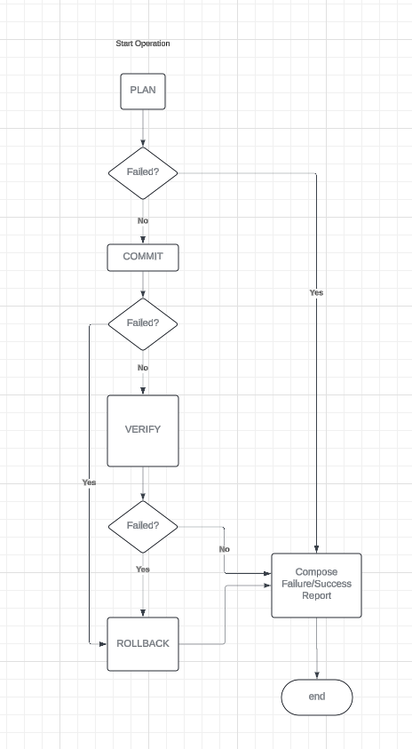

= Trento Agent Operators

An `+operator+` is a unit of code that can perform write operations on target machines.

Each operator knows how to execute actions and how to roll them back in
case of failure.

== Operator

An operator is a unit of code that can perform write operations on
target machines. +
A write operation can either fail or succeed. If it succeeds, the
operation displays a diff highlighting the changes before and after the
commit phase.

The operator accepts arguments to specify how to perform the operations.
The arguments are in the form of a `+map[string]any+`, and each operator
knows how to extract and validate them. +
It follows a transactional approach, where each operation has distinct
stages:

* PLAN +
* COMMIT +
* VERIFY +
* ROLLBACK

The documentation for each of the operators can be found in the
operators go source.

=== PLAN

The goal of the PLAN stage is to collect information about the
operations and verify prerequisites. +
This is also the phase where information for diffing is gathered by
collecting the `+before+` state.

Additionally, during this phase, it is important to ensure that any
resources modified during the COMMIT phase are backed up. This allows
restoration during the ROLLBACK phase or manual recovery by system
administrators if the rollback fails.

If an error occurs during the PLAN phase, no rollback is needed; the
operation is simply aborted with the plan error.

=== COMMIT

The COMMIT phase executes the actual write operations on the system,
utilizing the information collected during the PLAN phase. +
If an error occurs during this phase, a rollback is triggered.

The COMMIT phase should be idempotent. If a requested change has already
been applied, the commit operation is simply skipped without returning
an error. +
Idempotency should be implemented appropriately based on the type of
operations to be performed.

=== VERIFY

The VERIFY phase ensures that the actions applied during the COMMIT
phase have produced the expected results on the system. +
If an error occurs during this phase, the rollback process is initiated.

This phase is also when the `+after+` state is recorded for the diff,
highlighting changes made during the commit phase.

=== ROLLBACK

The ROLLBACK phase must implement mechanisms to revert any changes made
during the COMMIT phase. +
It can use information collected during the PLAN phase to restore the
system to its previous state. +
The rollback implementation may vary depending on the type of operation
performed during the COMMIT phase. +
Be sure to provide clear error messages and log actions appropriately.

If the rollback fails, the error is returned without further action.

== Executor

The Executor is a wrapper around an operator. The operator implements
the phase interface and must be wrapped in an Executor.

The Executor manages operations transactionally. +
For library users, the Executor is transparent—using an Operator means
it is already wrapped within an Executor.

== Registry

The Registry holds all available operators. Each operator has a version.
By default, if no version is specified when requesting an operator, the
latest version is fetched from the Registry.

To use an operator, it must be fetched using the `+GetOperatorBuilder+`
function, providing the operator name as an argument.

[source,go]
----
builder, err := registry.GetOperatorBuilder(operatorName)
op := builder("test-cli", opArgs)
report := op.Run(ctx)
// the report contains the success or the error of the execution
----

The operator name follows this format: `+<operatorname>@<version>+`.

The Registry returns an Operator Builder:

[source,go]
----
type OperatorBuilder func(operationID string, arguments OperatorArguments) Operator
----

The `+operationID+` is a unique identifier for the operation, and
`+arguments+` are modeled as `+map[string]any+`.

== CLI

The operators execution is also exposed as a `+CLI+`. The functionality is
hidden as it is intended only for testing and development purposes.

=== Usage

....
Run operator

Usage:
  trento-agent operator run [flags]

Flags:
  -a, --arguments string   The used operator arguments
  -h, --help               help for run
  -o, --operator string    The operator to use

....

The CLI accepts the name of an operator as an argument, following the
same convention `+<operatorname>@<version>+`, and requires the `+-a+`
option to pass the arguments.

The arguments must be provided as a JSON string.

=== Example

[source,bash]
----
sudo ./trento-agent operator run -o saptuneapplysolution -a '{"solution": "HANA"}'
----

Using `+sudo+` may be necessary depending on the type of operator being
executed. +
In this example, the `+saptuneapplysolution+` operator is called with
the argument `+solution+` set to `+HANA+`.

The CLI will perform the operations, log any errors, and finally display
the diff when the execution succeeds.
